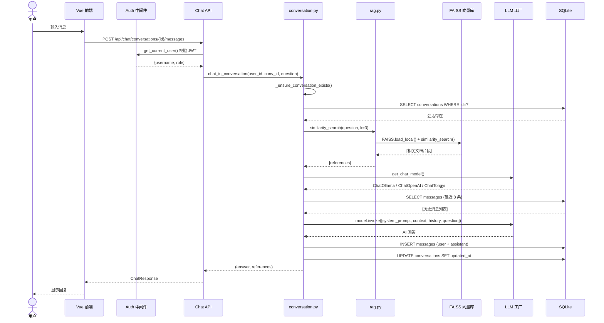
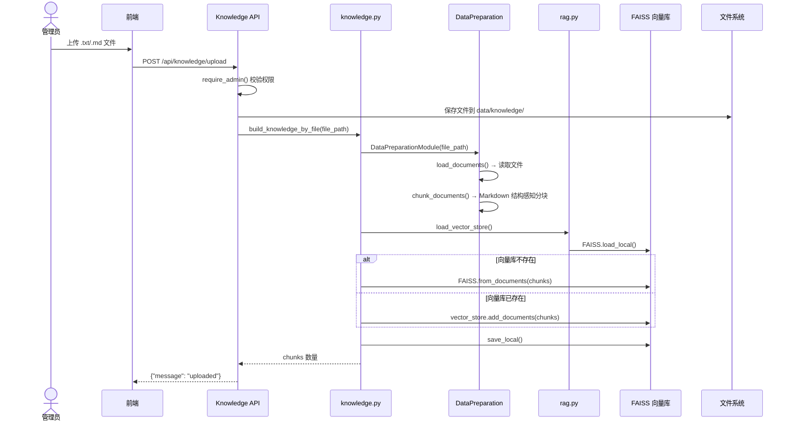
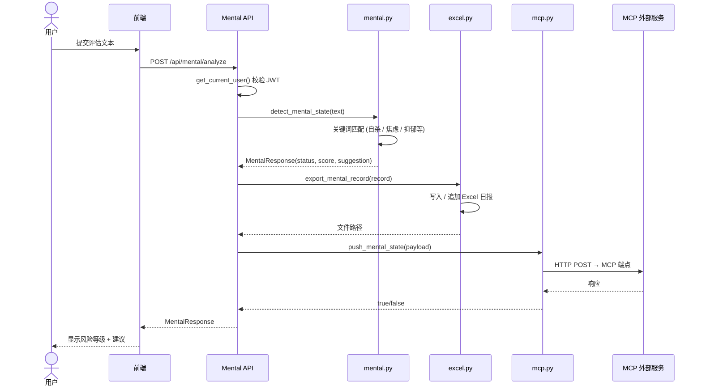
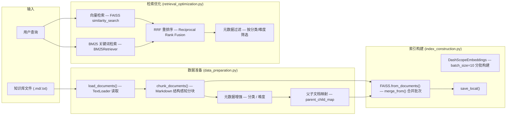

# 心护AI (Mental Guard AI)

> 基于 RAG 的心理健康智能助手 —— 集多轮对话、心理评估与知识库管理于一体。

## 技术栈

| 层级 | 技术 |
|------|------|
| 后端框架 | FastAPI + Uvicorn |
| AI 框架 | LangChain（Chat + Embeddings + RAG） |
| 向量检索 | FAISS + DashScope Embeddings |
| LLM 后端 | Ollama / OpenAI / 阿里云百炼 (DashScope) |
| 数据存储 | SQLite（会话 & 消息持久化） |
| 认证鉴权 | JWT + OAuth2 Password Bearer |
| 前端框架 | Vue 3 + Vite + TypeScript |
| UI 组件库 | Element Plus |
| 状态管理 | Pinia + Vue Router |
| HTTP 客户端 | Axios |

## 功能概览

- **多轮对话** —— RAG 增强回复，SQLite 持久化会话历史，支持会话 CRUD
- **知识库管理** —— 管理员上传 `.txt` / `.md` 文件，Markdown 结构感知分块，增量构建 FAISS 索引
- **心理状态识别** —— 规则引擎检测风险关键词，支持替换为 LoRA 微调模型
- **数据沉淀** —— 心理评估结果自动推送到 MCP 外部服务，并导出 Excel 日报
- **多模型切换** —— 支持 Ollama 本地模型、OpenAI API、阿里云百炼，`.env` 一键切换
- **权限隔离** —— JWT 认证，管理员（知识库管理）与普通用户（对话 & 评估）角色分离

## 项目结构

```
mental_guard_ai/
├── app/
│   ├── main.py                    # FastAPI 入口，路由注册
│   ├── api/
│   │   ├── auth.py                # 登录 / JWT 签发 / 用户信息
│   │   ├── chat.py                # 对话 & 会话 CRUD
│   │   ├── knowledge.py           # 知识库上传 / 索引重建
│   │   └── mental.py              # 心理状态分析
│   ├── core/
│   │   ├── config.py              # 全局配置（Pydantic Settings）
│   │   ├── security.py            # JWT + OAuth2 + 用户库
│   │   └── exceptions.py          # 全局异常处理
│   ├── models/
│   │   └── llm.py                 # LLM 工厂（Ollama / OpenAI / DashScope）
│   ├── services/
│   │   ├── conversation.py        # SQLite 会话 & 消息持久化
│   │   ├── retrieval.py            # FAISS 向量库加载 & 检索
│   │   ├── chat.py                # （兼容旧版）内存会话
│   │   ├── knowledge.py           # 知识库向量化 & 索引构建
│   │   ├── mental.py              # 风险关键词检测
│   │   ├── mcp.py                 # MCP 外部服务推送
│   │   └── excel.py               # Excel 导出
│   ├── rag/                       # RAG 数据准备模块
│   │   ├── data_preparation.py    # 文档加载 / Markdown 分块 / 元数据增强
│   │   ├── index_construction.py
│   │   ├── retrieval_optimization.py
│   ├── schemas/                   # Pydantic 请求/响应模型
│   │   ├── user.py
│   │   ├── chat.py
│   │   └── mental.py
│   └── utils/
│       ├── vector.py              # Embeddings 工厂
│       └── file.py                # 数据目录初始化
├── frontend/                      # Vue 3 + Vite 前端
│   ├── src/
│   │   ├── views/                 # 页面：聊天 / 心理分析 / 知识库 / 登录
│   │   ├── api/                   # Axios 封装（auth, chat, knowledge, mental）
│   │   ├── stores/                # Pinia 状态管理
│   │   └── router/                # Vue Router 路由
│   ├── package.json
│   └── vite.config.ts
├── data/                          # 运行时数据（自动生成）
│   ├── knowledge/                 # 上传的知识库文件
│   ├── vector_store/              # FAISS 索引
│   ├── exports/                   # Excel 导出
│   ├── logs/
│   └── app.db                     # SQLite 数据库
├── models/finetuned/              # LoRA 微调模型目录
├── .env.example                   # 环境变量模板
├── requirements.txt
├── run.py                         # 一键启动脚本
└── README.md
```

## 系统架构

### 架构总览

```mermaid
flowchart TB
    subgraph Frontend["前端 (Vue 3 + Vite + Element Plus)"]
        LoginPage["登录页"]
        ChatPage["对话页"]
        MentalPage["心理分析页"]
        KnowledgePage["知识库管理页"]
    end

    subgraph Backend["后端 (FastAPI)"]
        direction TB

        subgraph Auth["认证模块"]
            AuthAPI["POST /api/auth/login"]
            MeAPI["GET /api/auth/me"]
            JWT["JWT 签发 & 校验 (OAuth2PasswordBearer)"]
            UserDB["内存用户库 (admin / user)"]
        end

        subgraph Chat["对话模块"]
            ChatAPI["POST /api/chat + /conversations/*"]
            ConvService["conversation.py — SQLite 会话 & 消息持久化"]
            ChatService["chat.py — (兼容旧版) 内存会话"]
        end

        subgraph Knowledge["知识库模块"]
            KnowledgeUpload["POST /api/knowledge/upload"]
            KnowledgeRebuild["POST /api/knowledge/rebuild"]
            KnowService["knowledge.py — 文件加载 → 分块 → 向量化"]
        end

        subgraph Mental["心理评估模块"]
            MentalAPI["POST /api/mental/analyze"]
            MentalService["mental.py — 风险关键词匹配"]
            ExcelService["excel.py — Excel 日报导出"]
            MCPService["mcp.py — MCP HTTP 推送"]
        end

        subgraph RAG["RAG 检索引擎"]
            RAGService["retrieval.py — FAISS 向量库加载 & 检索"]
            VectorUtils["vector.py — DashScope Embeddings"]
        end

        subgraph LLM["LLM 工厂"]
            LLMFactory["llm.py — Ollama / OpenAI / DashScope"]
        end

        subgraph Core["核心基础设施"]
            Config["config.py — Pydantic Settings"]
            Exceptions["exceptions.py — 全局异常处理"]
            FileUtils["file.py — 数据目录初始化"]
        end
    end

    subgraph Storage["数据存储"]
        SQLite[("SQLite — app.db — conversations + messages")]
        FAISS[("FAISS 向量索引 — data/vector_store/")]
        KnowledgeFiles["知识库文件 — data/knowledge/"]
        ExcelFiles["Excel 导出 — data/exports/"]
    end

    subgraph External["外部服务"]
        Ollama["Ollama 本地模型"]
        OpenAI["OpenAI API"]
        DashScope["阿里云百炼 DashScope API"]
        MCP["MCP 外部服务 — 心理状态接收"]
    end

    Frontend -->|HTTP + JWT| Backend

    AuthAPI --> JWT --> UserDB
    ChatAPI --> ConvService
    ChatAPI --> ChatService
    KnowledgeUpload --> KnowService
    KnowledgeRebuild --> KnowService

    ConvService --> RAGService
    ChatService --> RAGService
    ConvService --> LLMFactory
    ChatService --> LLMFactory
    KnowService --> RAGService

    MentalAPI --> MentalService
    MentalService --> ExcelService
    MentalService --> MCPService

    RAGService --> VectorUtils
    KnowService --> VectorUtils

    Config -.->|配置注入| Backend

    ConvService --> SQLite
    KnowService --> KnowledgeFiles
    KnowService --> FAISS
    RAGService --> FAISS
    ExcelService --> ExcelFiles
    MCPService --> MCP

    LLMFactory --> Ollama
    LLMFactory --> OpenAI
    LLMFactory --> DashScope
    VectorUtils --> DashScope
```



### 对话请求完整链路



### 知识库上传链路



### 心理评估链路



### 高级 RAG 模块 (`app/rag/`)

> 注意：`app/rag/` 为独立的高级 RAG 流水线（混合检索），当前主 API 路由使用的是 `app/services/` 下的简化版。`rag/` 模块保留了 BM25 + RRF 混合检索等高级能力，待接入。



## 快速启动

### 环境要求

- Python 3.10+
- Node.js 18+
- [Ollama](https://ollama.com)（如使用本地模型，需提前拉取 `qwen2.5:7b` 或其他模型）

### 1. 后端

```bash
# 安装 Python 依赖
pip install -r requirements.txt

# 配置环境变量
cp .env.example .env
# 编辑 .env，至少修改 JWT_SECRET_KEY 和管理员密码

# 启动后端（二选一）
uvicorn app.main:app --host 0.0.0.0 --port 8000 --reload
# 或
python run.py
```

### 2. 前端

```bash
cd frontend

# 安装依赖
npm install

# 启动开发服务器
npm run dev
```

前端开发服务器默认运行在 `http://localhost:5173`，API 代理配置见 `frontend/vite.config.ts`。

### 3. 验证

- 后端 Swagger 文档：`http://127.0.0.1:8000/docs`
- 健康检查：`http://127.0.0.1:8000/health`
- 前端页面：`http://localhost:5173`

## 默认账户

| 角色 | 用户名 | 密码 |
|------|--------|------|
| 管理员 | `admin` | `admin123` |
| 普通用户 | `user` | `user123` |

> 生产环境务必在 `.env` 中修改默认账号和 `JWT_SECRET_KEY`。

## API 概览

### 认证

| 方法 | 路径 | 说明 |
|------|------|------|
| POST | `/api/auth/login` | 登录，返回 JWT Token |
| GET | `/api/auth/me` | 获取当前用户信息 |

### 对话 & 会话管理

| 方法 | 路径 | 说明 |
|------|------|------|
| POST | `/api/chat` | 发送消息（兼容旧版 session_id） |
| POST | `/api/chat/conversations` | 创建新会话 |
| GET | `/api/chat/conversations` | 获取会话列表 |
| PATCH | `/api/chat/conversations/{id}` | 重命名会话 |
| DELETE | `/api/chat/conversations/{id}` | 删除会话（软删除） |
| GET | `/api/chat/conversations/{id}/messages` | 获取会话历史消息 |
| POST | `/api/chat/conversations/{id}/messages` | 在会话中发送消息 |

### 知识库（需管理员权限）

| 方法 | 路径 | 说明 |
|------|------|------|
| POST | `/api/knowledge/upload` | 上传 `.txt` / `.md` 文件，增量构建索引 |
| POST | `/api/knowledge/rebuild` | 全量重建 FAISS 索引 |

### 心理评估

| 方法 | 路径 | 说明 |
|------|------|------|
| POST | `/api/mental/analyze` | 提交文本，返回风险等级 + MCP 推送 + Excel 导出 |

## 配置说明

`.env` 关键配置项：

```ini
# LLM 后端切换
LLM_PROVIDER=ollama              # ollama | openai | dashscope
OLLAMA_BASE_URL=http://localhost:11434
OLLAMA_MODEL=qwen2.5:7b

# OpenAI（LLM_PROVIDER=openai 时生效）
OPENAI_API_KEY=sk-xxx
OPENAI_MODEL=gpt-4o-mini

# 阿里云百炼（LLM_PROVIDER=dashscope 时生效）
DASHSCOPE_API_KEY=sk-xxx
DASHSCOPE_MODEL=qwen3-max
EMBEDDING_MODEL=text-embedding-v1

# 认证
JWT_SECRET_KEY=change_me_to_long_random_string
ADMIN_USERNAME=admin
ADMIN_PASSWORD=admin123

# MCP 外部服务
MCP_ENDPOINT=http://localhost:9001/mcp/mental-state
```

## LoRA 微调模型接入

当前 `app/services/mental.py` 为规则引擎版 MVP，可替换为真实模型推理：

1. 将 LoRA/PEFT 权重放入 `models/finetuned/`
2. 在 `app/models/llm.py` 或 `app/services/mental.py` 中加载微调模型
3. 返回统一结构：
   - `status`: `high_risk | medium_risk | low_risk`
   - `score`: `0-1` 概率
   - `suggestion`: 干预建议